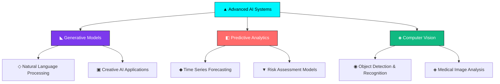

# ◉ SURAJ SINGH

<div align="center">
  
[](https://git.io.typing-svg)

</div>

<div align="center">


</div>

---

## ◈ **NEURAL ARCHITECTURE**

```yaml
▣ SYSTEM_SPECS:
  ├── Name: Suraj Singh
  ├── Role: AI Research Engineer  | Innovation Architect  
  ├── Education: B.Tech Electrical Engineering | NITK Surathkal
  ├── Location: Bengaluru, Karnataka, India
  └── Status: Engineering the Future of Intelligence 

◇ CORE_PROCESSING_UNITS: 
  ├── Generative AI & Large Language Models
  ├── Neural Network Architecture & Optimization
  ├── Advanced Machine Learning Systems
  ├── Time Series Forecasting & Prediction 
  ├── Computer Vision & Deep Learning
  └── AI-Driven Innovation Engineering    

◆ MISSION_DIRECTIVE:
  └── "Architecting AI solutions that redefine technological boundaries "
```

---

## ⚡ **TECH-ARSENAL**

### ▲ **AI/ML Frameworks**
<div align="center">


</div>

### ◣ **Core Technologies**
<div align="center..">


</div>

### ◈ **Cloud & Infrastructure**
<div align="center ">


</div>

### ◧ **Data Engineering**
<div align="center">


</div>

---

## ◈ **QUANTUM METRICS**

<div align="center">
  


</div>

<div align="center">


</div>

---

## ◇ **INNOVATION PIPELINE**

### ◆ **Current Research Focus**



---

## ◈ **CREATIVITY ENGINE**

<details>
<summary>◆ <b>Experimental AI Lab</b></summary>

```python
class AIInnovator:
    def __init__(self):
        self.expertise = [
            "▲ Neural Architecture Design",
            "◇ Predictive Model Engineering", 
            "◈ Computer Vision Systems",
            "◧ Data Science & Analytics",
            "◉ MLOps & Model Deployment"
        ]
        
    def build_future(self):
        while True:
            innovation = self.research() + self.experiment() + self.implement()
            if innovation.transforms_industry():
                return innovation.deploy_to_world()
    
    def current_focus(self):
        return {
            "generative_ai": "Building next-gen language models",
            "computer_vision": "Advancing medical imaging AI",
            "time_series": "Revolutionary forecasting algorithms",
            "optimization": "Neural architecture search automation"
        }

# Initialize the innovation engine
ai_architect = AIInnovator()
future = ai_architect.build_future()
```

</details>

<details>
<summary>◇ <b>Learning Trajectory</b></summary>

```yaml
2024-2025: ▲ AI Research & Innovation
  ├── ◈ Advanced Neural Networks
  ├── ◇ Large Language Models  
  ├── ◧ Generative AI Systems
  └── ◆ Computer Vision Applications

2023-2024: ◣ Full-Stack AI Development
  ├── ▼ Python Ecosystem Mastery
  ├── ◈ Cloud Architecture (AWS/GCP)
  ├── ◉ MLOps & Model Deployment
  └── ◇ Data Engineering Pipelines

2022-2023: ▣ Electrical Engineering Foundation
  ├── ◆ B.Tech from NITK Surathkal
  ├── ◧ Power Systems & Electronics
  ├── ◈ Signal Processing
  └── ▲ Control Systems & Automation
```

</details>

---

## ◉ **NEURAL NETWORK**

<div align="center">

[](https://linkedin.com/in/yourprofile)
[](https://twitter.com/yourhandle)
[](https://yourportfolio.com)
[](mailto:your.email@example.com)

</div>

---

## ◇ **INNOVATION PHILOSOPHY**

<div align="center">

> *"In the intersection of artificial intelligence and human creativity lies the blueprint for humanity's next evolutionary leap. Every algorithm I architect, every model I train, every system I build is a step toward a future where technology amplifies human potential rather than replacing it."*

**— Building Tomorrow's Intelligence,, Today**

</div>

---

<div align="center">
  
### ◉ **"The future belongs to those who understand both the science of what is possible and the art of what should be built."**


</div>

---

<div align="center">

**▲ Star this repository if you believe in the power of AI to transform our world! ▲**


</div>
