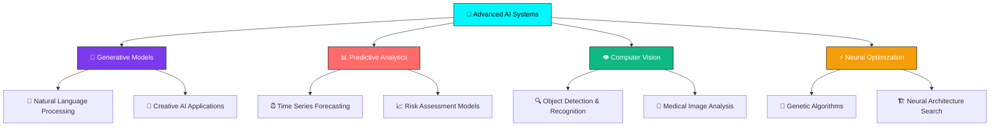

# ◉ SURAJ SINGH

<div align="center">
  
[](https://git.io.typing-svg)

</div>

<div align="center">
  

[](https://github.com/StrataMind?tab=followers)
[](https://github.com/StrataMind?tab=repositories)
[](https://github.com/StrataMind)

</div>


## 📰 **VISIT OUR BLOG SITE** 

<div align="center">

[](https://www.publixly.com/)

### 📝 **Stay Updated with Latest Tech Insights**  
*Explore cutting-edge technology articles, AI  research insights, and innovation stories*

**✨ What you'll find:** 
- 🤖 **AI & Machine Learning** deep dives   
- 💡 **Tech Innovation** trends and analysis  
- 🚀 **Startup Journey** experiences and lessons 
- 📊 **Data Science** tutorials and case studies
- 🔮 **Future Tech** predictions and insights   

**[Visit Publixly →](https://www.publixly.com/)**

</div>


## 🛒 **FINDORA - ECOMMERCE PLATFORM**

<div align="center">

[](https://findora-tau.vercel.app/)

### 🏪 **Next-Gen Online Shopping Experience**
*Discover products with AI-powered recommendations and seamless user experience*

**🎯 Key Features:**
- 🤖 **Smart Recommendations** - AI-driven product suggestions
- 🔍 **Advanced Search** - Find exactly what you're looking for  
- 💳 **Secure Payments** - Safe and reliable checkout process
- 📱 **Mobile Optimized** - Perfect shopping experience on any device  
- ⚡ **Fast Loading** - Optimized performance for quick browsing

**[Shop at Findora →](https://findora-tau.vercel.app/)**

</div>


## ◈ **NEURAL ARCHITECTURE**

```yaml
▣ SYSTEM_IDENTITY:
  ├── 🧬 Name: Suraj Singh | StrataMind
  ├── 🚀 Role: AI Research Engineer | Neural Network Architect  
  ├── 🎓 Education: B.Tech Electrical Engineering | NITK Surathkal
  ├── 📍 Location: Mangalore → Bengaluru, Karnataka, India 
  ├── 🎯 Mission: Engineering AI Solutions that Transform Industries
  └── ⚡ Status: Building the Future, One Algorithm at a Time

◇ CORE_PROCESSING_UNITS:   
  ├── 🤖 Large Language Models & Generative AI
  ├── 🧠 Neural Network Architecture & Optimization
  ├── 📊 Time Series Forecasting & Predictive Analytics
  ├── 👁️ Computer Vision & Deep Learning Systems   
  ├── ⚙️ MLOps & Model Deployment Automation 
  ├── 🔧 Advanced Feature Engineering Pipelines
  └── 📈 Hyperparameter Optimization & AutoML     
  
◆ INNOVATION_PHILOSOPHY:
  └── "Where Data Meets Intelligence, Magic Happens ✨"
```


## ⚡ **TECH ARSENAL**

<div align="center">

### 🧠 **AI/ML Powerhouse**


### 💻 **Development Stack**


### ☁️ **Cloud & Infrastructure**


### 🗄️ **Data Engineering**


</div>


## 📊 **QUANTUM METRICS**

<div align="center">
  


</div>

<div align="center">


</div>


## 🚀 **RESEARCH PIPELINE**

<div align="center">

### 🔬 **Current AI Research Focus**


</div>


## 🎯 **FEATURED PROJECTS**

<div align="center">

[](https://github.com/StrataMind/ecommerce-recommendation-engine)
[](https://github.com/StrataMind/HireNet)
[](https://github.com/StrataMind/GreenPulse)
[](https://github.com/StrataMind/FARMLINK)

### 🚀 **More Innovative Projects**
[](https://github.com/StrataMind/Game-Zone)

</div>


## 💡 **INNOVATION LAB**

<details>
<summary>🧪 <b>AI Research Experiments</b></summary>

```python
class AIInnovator:
    def __init__(self):
        self.name = "Suraj Singh"
        self.expertise = [
            "🧠 Neural Architecture Design",
            "📊 Predictive Model Engineering", 
            "👁️ Computer Vision Systems", 
            "📈 Data Science & Analytics",
            "⚙️ MLOps & Model Deployment",
            "🔧 Advanced Feature Engineering",
            "⚡ Hyperparameter Optimization"
        ]
        self.current_research = {
            "lstm_optimization": "Genetic & Heap-based tuning for time series",
            "awes_feature_engineering": "Advanced pipeline for wind energy data",
            "local_llm": "Fully contextual Q&A system",
            "sports_ai": "Multi-language content generation"
        }
        
    def build_future(self):
        while self.passion_for_ai:
            innovation = (
                self.research() + 
                self.experiment() + 
                self.implement() + 
                self.optimize()
            )
            if innovation.transforms_industry():
                return innovation.deploy_to_world()
    
    def get_mission(self):
        return "Building AI solutions that amplify human potential 🚀"

# Initialize the innovation engine
ai_architect = AIInnovator()
future = ai_architect.build_future()
```

</details>

<details>
<summary>🎯 <b>Learning & Growth Timeline</b></summary>

```yaml
📅 2024-2025: AI Research & Innovation Era
  ├── 🤖 Large Language Models Mastery
  ├── 🧠 Advanced Neural Networks
  ├── 📊 Time Series Forecasting Research  
  ├── 👁️ Computer Vision Applications
  └── ⚡ Hyperparameter Optimization Techniques

📅 2023-2024: Full-Stack AI Development
  ├── 🐍 Python Ecosystem Deep Dive
  ├── ☁️ Cloud Architecture (AWS/GCP)
  ├── 🔄 MLOps & Model Deployment
  ├── 📊 Data Engineering Pipelines
  └── 🔧 Advanced Feature Engineering

📅 2021-2025: Engineering Foundation
  ├── ⚡ B.Tech Electrical Engineering @ NITK Surathkal 
  ├── 🔌 Power Systems & Electronics
  ├── 📡 Signal Processing & Control Systems
  ├── 🏆 JEE Advanced (CRL < 12,500)
  └── 🎯 NTSE Scholar
```

</details>

<details>
<summary>📈 <b>Research Publications & Achievements</b></summary>

### 🏆 **Key Accomplishments**
- 🎓 **B.Tech Electrical Engineering** - NITK Surathkal (CGPA: Excellent)
- 🏅 **JEE Advanced Qualified** - CRL Rank under 12,500
- 🏆 **NTSE Scholar** - National Level Achievement  
- 📝 **ML Research Internship** - Advanced AI Solutions
- 🚀 **Multiple AI Projects** - Published on GitHub

### 📊 **Research Papers (In Progress)**
- 📄 "Optimised LSTM Networks for Time Series Forecasting using Genetic & Heap-Based Hyperparameter Tuning"
- 📄 "Advanced Feature Engineering Pipeline for Airborne Wind Energy Systems"
- 📄 "Multi-language Sports Content Generation using AI"

### 🎯 **Future Vision**
- 💼 Securing high-impact AI roles in top companies
- 🚀 Building AI-powered startup ventures
- 🏛️ Long-term: Contributing to policy and governance
- 🌟 Creating large-scale humanitarian impact through technology

</details>


## 🌐 **NEURAL NETWORK CONNECTIONS**

<div align="center">

[](https://surajsk2003.github.io/Suraj.in/)
[](https://linkedin.com/in/suraj-singh-96b45220a)
[](mailto:surajkumarsksk2000@gmail.com)
[](https://youtube.com/@NicheVortex)
[](https://medium.com/@surajsk2003)

</div>


## 🎨 **CREATIVITY BEYOND CODE**

<div align="center">

### 📹 **Content Creation**
**🚀 Niche Vortex** - YouTube Channel focused on Science, Space & Technology  
**📝 Medium Articles** - Mental Health, Productivity & Personal Growth  
**🎬 Upcoming** - Meme-focused YouTube Shorts Channel

### 🏃‍♂️ **Life Balance**
**💪 Fitness Enthusiast** - Intense 10-day gym cycles with cardio & strength training  
**♟️ Strategic Mind** - Chess, Cricket & Basketball player  
**🌿 Nature Explorer** - Lover of hills, seas, and green landscapes

</div>


## 💭 **INNOVATION PHILOSOPHY**

<div align="center">

> ### 🧠 *"At the intersection of artificial intelligence and human creativity lies the blueprint for humanity's next evolutionary leap."*

> ### ⚡ *"Every algorithm I architect, every model I train, every system I build is a step toward a future where technology amplifies human potential."*

> ### 🚀 *"The future belongs to those who understand both the science of what is possible and the art of what should be built."*

**— Engineering Tomorrow's Intelligence, Today 🌟**

</div>


<div align="center">

### 🌟 **"The best way to predict the future is to invent it."**


---

**⭐ Star this repository if you believe in the power of AI to transform our world! ⭐**


**💡 Always building, always learning, always innovating! 💡**

</div>
